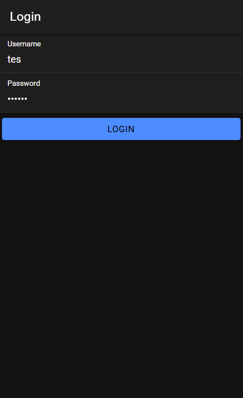
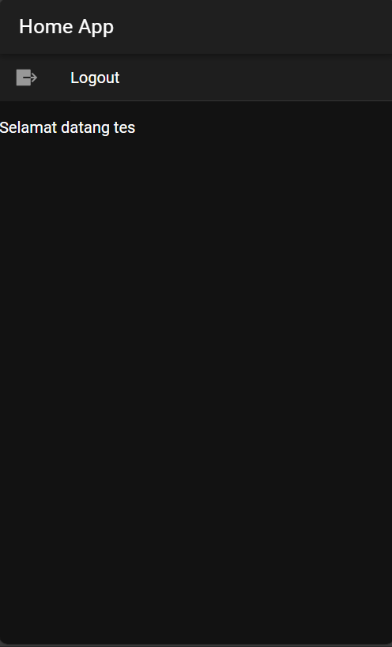

# LabMobile7_Khansa-Delphi_H1D022038

## Screenshot



## Cara Kerja Login
1. **Backend (PHP API)**
- Pada file `koneksi.php`, file ini membuat koneksi ke database coba-ionic. Koneksi ini digunakan untuk memeriksa data login di database.
- Pada file `login.php` nantinya akan mengambil input dari JSON yang dikirim oleh aplikasi ionic.
```
$input = file_get_contents('php://input');
$data = json_decode($input, true);
```
- Data username dan password diambil dari input tersebut, lalu query dijalankan untuk memeriksa apakah kombinasi username dan password ada di tabel user.
```
$username = trim($data['username']);
$password = md5(trim($data['password']));
$query = mysqli_query($con, "select * from user where username='$username' and
password='$password'");
```
- Jika data ditemukan, maka login berhasil dan sistem mengembalikan username dan token yang dihasilkan dari time() dan password yang di hash.
- Jika data tidak ditemukan, sistem akan mengembalikan status gagal.
```
$jumlah = mysqli_num_rows($query);
if ($jumlah != 0) {
    $value = mysqli_fetch_object($query);
    $pesan['username'] = $value->username;
    $pesan['token'] = time() . '_' . $value->password;
    $pesan['status_login'] = 'berhasil';
} else {
    $pesan['status_login'] = 'gagal';
}
echo json_encode($pesan);
echo mysqli_error($con);
```
2. **Frontend (Aplikasi Ionic)**
- Pada file `app.module.ts` terdapat provideHttpClient yang berguna agar aplikasi dapat berkomunikasi dengan API.
```
import { provideHttpClient } from '@angular/common/http';
```
- File `authentication.service.ts` memiliki postMethod untuk mengirim data login ke login.php menggunakan metode POST.
```
postMethod(data: any, link: any): Observable<any> {
    return this.http.post(this.apiURL() + '/' + link, data);
  }
```
- Ada juga saveData untuk menyimpan token dan username di Preferences jika login berhasil, lalu mengubah isAuthenticated menjadi true.
```
saveData(token: string, user: any) {
    Preferences.set({ key: TOKEN_KEY, value: token });
    Preferences.set({ key: USER_KEY, value: user });
    this.token = token;
    this.nama = user;
    this.isAuthenticated.next(true);
  }
Lalu logout untuk membersihkan data dan mengubah isAuthenticated menjadi false.
  logout() {
    this.isAuthenticated.next(false);
    this.clearData();
  }
```

3. **Login page (`login.page.ts`)**
- Method login() ini mengirim username dan password ke server menggunakan postMethod. Jika respon dari server menunjukkan login berhasil (status_login == "berhasil"), data token dan username disimpan menggunakan saveData. Jika login gagal, notifikasi ditampilkan. 
  ```
  login() {
    if (this.username != null && this.password != null) {
      const data = {
        username: this.username,
        password: this.password
      }
      this.authService.postMethod(data, 'login.php').subscribe({
        next: (res) => {
          if (res.status_login == "berhasil") {
            this.authService.saveData(res.token, res.username);
            this.username = '';
            this.password = '';
            this.router.navigateByUrl('/home');
          } else {
            this.authService.notifikasi('Username atau Password Salah');
          }
        },
        error: (e) => {
          this.authService.notifikasi('Login Gagal Periksa Koneksi Internet Anda');
        }
      })
    } else {
      this.authService.notifikasi('Username atau Password Tidak Boleh Kosong');
    }
  }
  ```

4. **Routing dan Guard**
- authGuard di file `auth.guard.ts` ini mengarahkan pengguna ke halaman login jika belum terautentikasi.
- autoLoginGuard di file `auto-login.guard.ts` ini mengarahkan pengguna yang sudah login ke halaman home.
```
const routes: Routes = [
  {
    path: 'home',
    loadChildren: () => import('./home/home.module').then(m => m.HomePageModule),
    canActivate: [authGuard]
  },
  {
    path: '',
    redirectTo: 'login',
    pathMatch: 'full'
  },
  {
    path: 'login',
    loadChildren: () => import('./login/login.module').then(m => m.LoginPageModule),
    canActivate: [autoLoginGuard]
  },
];
```